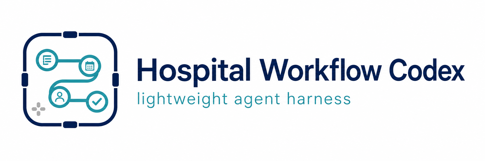

<p align="center">
  
</p>

<p align="center">
  <strong>病院の非診療業務を、Codexと安全に整理・文書化するための業務支援パッケージ</strong>
</p>

<p align="center">
  日本語 | <a href="README.en.md">English</a>
</p>

# Hospital Workflow Codex Skills

病院で発生する事務、運用、教育、文書作成などの業務を、Codexで整理・改善するためのハーネスです。Codexが安全に作業するためのルール、進め方、ひな形がひとまとめになっています。

やりたいことを日本語で伝えるだけで、目的に合った進め方を選び、マニュアル、Excel表、会議整理、研修資料などを**実際のファイルとして作成**します。

## こんなときに使えます

- 部署内のマニュアルや手順書を作りたい
- 会議メモから決定事項や担当者を整理したい
- Excelへの二重入力や転記作業を見直したい
- 院内のお知らせ、依頼文、報告書を作りたい
- 研修資料やPowerPointを作りたい
- アンケート結果を集計して改善点を整理したい
- 既存のExcel、Word、PowerPoint様式に情報をまとめたい

## クイックスタート

### 1. Codexアプリに準備を依頼する

Codexアプリを起動し、チャット欄に次の文章を貼り付けてください。

```text
次のGitHubリポジトリをgit cloneして、Codexで利用できるように準備してください。

https://github.com/Yuya-Ishibashi0/hospital-workflow-codex-skills

README.mdとAGENTS.mdを確認し、準備が完了したら保存先と次の操作を日本語で案内してください。
```

Codexがリポジトリの取得と確認を行います。途中でアクセス許可を求められた場合は、表示された内容を確認して許可してください。

### 2. 準備されたフォルダを開く

Codexから案内された `hospital-workflow-codex-skills` フォルダを、Codexアプリで開きます。

### 3. やりたいことを依頼する

チャット欄に、次のように入力してください。

```text
$hospital-workflow-harness
部署内の物品管理手順を整理して、新人向けマニュアルとチェックリストを作成してください。
```

依頼文には、分かる範囲で次の内容を含めると、より使いやすい成果物になります。

- 何を作りたいか
- 誰が使うか
- 現在困っていること
- 参考にしてほしいファイル
- Word、Excel、PowerPointなど希望する形式

すべて決まっていなくても問題ありません。不明な点はCodexが確認し、勝手に情報を補わずに整理します。

### 4. 作成されたファイルを確認する

成果物は原則として `outputs` フォルダに保存されます。

Codexのチャット欄には、作成したファイル、保存場所、確認が必要な点だけが短く表示されます。完成したマニュアルや表を、長いチャットからコピーし直す必要はありません。

### 自分で取得する場合

Gitに慣れている場合は、ターミナルから取得することもできます。

```bash
git clone https://github.com/Yuya-Ishibashi0/hospital-workflow-codex-skills.git
```

取得後、`hospital-workflow-codex-skills` フォルダをCodexアプリで開いてください。

## 依頼例

### マニュアルを作る

```text
$hospital-workflow-harness
新人職員向けの備品補充マニュアルをWordで作成してください。
対象者は配属1か月以内の職員です。
元になるメモを添付します。不明な部分は推測せず、確認事項として残してください。
```

### 会議内容を整理する

```text
$hospital-workflow-harness
添付した会議メモから、決定事項、未決事項、担当者、期限を整理してください。
共有用の議事録をWordで作成してください。
```

### アンケートを分析する

```text
$hospital-workflow-harness
添付した研修アンケートを集計し、全体傾向と改善要望を整理してください。
集計結果はExcel、報告書はWordで作成してください。
```

### 業務改善案を作る

```text
$hospital-workflow-harness
部署内で同じ情報を紙とExcelに二重入力しています。
現在の流れを整理し、低リスクで始められる改善案を提案書にしてください。
```

### 既存様式に整理する

```text
$hospital-workflow-harness
添付したメモの内容を、指定のExcel様式に整理してください。
不明な項目は空欄のままにし、確認が必要な項目を別にまとめてください。
```

## 作成できるもの

| やりたいこと | 主な成果物 |
| --- | --- |
| マニュアル・手順書作成 | Word、チェックリスト |
| 会議内容の整理 | Word議事録、アクション一覧 |
| 業務改善の検討 | Word提案書、業務フロー |
| 院内文書の作成 | Word文書 |
| アンケート分析 | Excel集計表、Word報告書 |
| 研修・掲示物の作成 | PowerPoint、Word |
| 既存様式への情報整理 | Excel、Word、PowerPoint |

希望する形式がある場合は、依頼時に「Wordで」「Excelで」「PowerPointで」と伝えてください。

## 安全に使うために

このハーネスは、病院の**非診療業務**を対象としています。

次の内容には使用しないでください。

- 患者の氏名、ID、病歴などの個人情報
- 電子カルテの内容
- 診断、治療方針、投薬などの医療判断
- 患者向け説明文
- 診療記録や申し送り文

作成された成果物はすべてたたき台です。院内で使用、配布、掲示する前に、担当者が内容と院内ルールを確認してください。

詳しくは[安全方針](docs/safety-guidelines.md)をご覧ください。

## このハーネスの特徴

- 依頼内容に合った進め方を自動で選びます
- 不明な情報を勝手に補完せず、確認事項として残します
- 成果物をチャットではなくWord、Excel、PowerPointなどのファイルで作ります
- 患者情報や診療判断を扱わないための安全ルールを備えています
- 最後に人が確認すべき点を明示します

## 詳しい資料

- [対象部門と利用例](docs/target-departments.md)
- [安全方針](docs/safety-guidelines.md)
- [利用シナリオ](use-cases/)

開発や改善に参加する方は、[Contribution Guide](docs/contribution-guide.md)をご覧ください。

## ライセンス

[MIT License](LICENSE)
